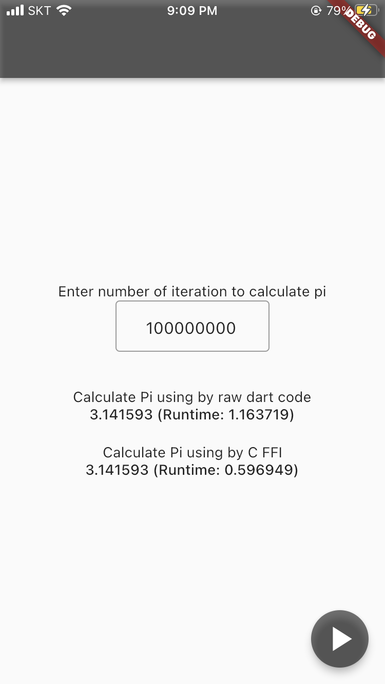
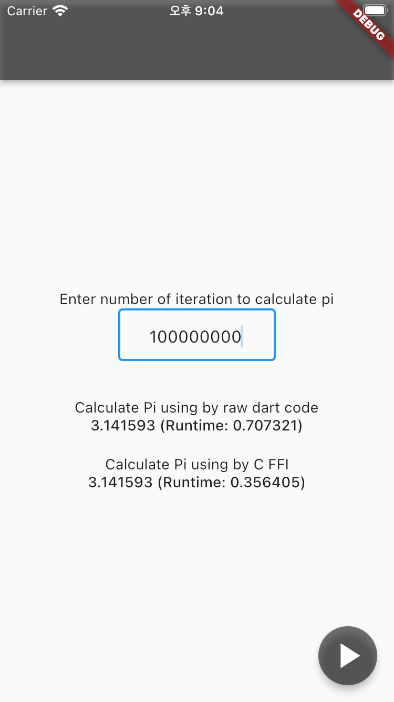
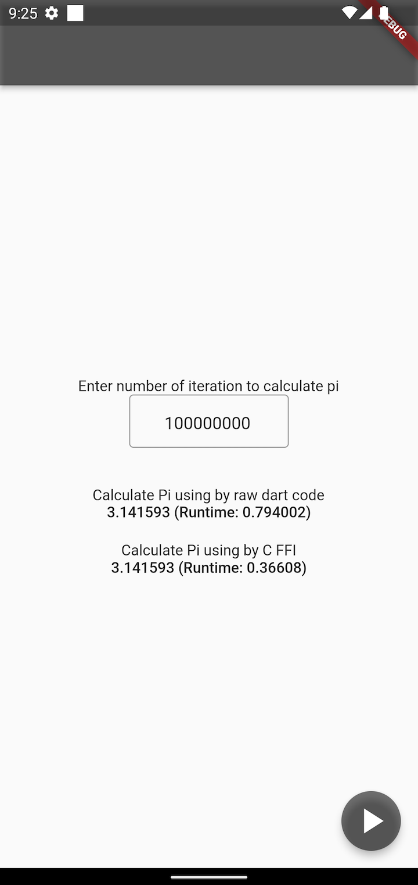

# Compare running time between Dart and C with FFI

For calculating Pi to use the [rate of convergence](https://en.wikipedia.org/wiki/Pi) like below.


## Environment

- Apple M1 Pro (14-inch, 2021), macOS 12.4
- iPhone SE (2nd generation), _physical device_

```shell
Doctor summary (to see all details, run flutter doctor -v):
[✓] Flutter (Channel stable, 3.0.1, on macOS 12.4 21F79 darwin-arm, locale en-KR)
[✓] Android toolchain - develop for Android devices (Android SDK version 32.1.0-rc1)
[✓] Xcode - develop for iOS and macOS (Xcode 13.4.1)
[✓] Chrome - develop for the web
[✓] Android Studio (version 2021.2)
[✓] VS Code (version 1.67.2)
[✓] Connected device (3 available)
[✓] HTTP Host Availability
```

## How to use

1. Enter number of iteration to calculate `pi`.
2. Click `play` action button on the bottom-right.

## Result

All FFI wrapper results are faster than raw Dart runtime. But, it depends on the device environment, complexity, and architecture. In my case, the C code has average `x2.0` speed.

| iPhone SE | iOS simulator | Android emulator |
|:--:|:--:|:--:|
|  |  |  |
| x1.95 | x1.98 | x2.17|

## Test

Run `flutter test` command, it just check result based on the number of iteration.
